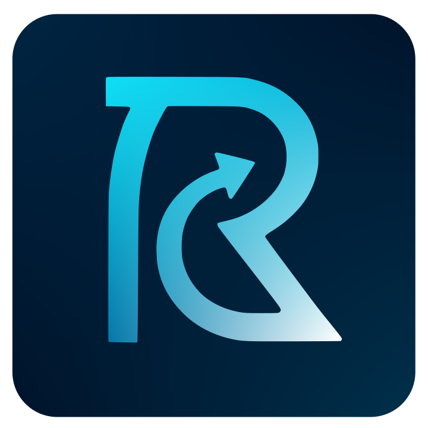

<!-- Improved compatibility of back to top link: See: https://github.com/othneildrew/Best-README-Template/pull/73 -->
<a id="readme-top"></a>
<!--
*** Thanks for checking out the Best-README-Template. If you have a suggestion
*** that would make this better, please fork the repo and create a pull request
*** or simply open an issue with the tag "enhancement".
*** Don't forget to give the project a star!
*** Thanks again! Now go create something AMAZING! :D
-->


<!-- PROJECT SHIELDS -->
<!--
*** I'm using markdown "reference style" links for readability.
*** Reference links are enclosed in brackets [ ] instead of parentheses ( ).
*** See the bottom of this document for the declaration of the reference variables
*** for contributors-url, forks-url, etc. This is an optional, concise syntax you may use.
*** https://www.markdownguide.org/basic-syntax/#reference-style-links
-->
[![Contributors][contributors-shield]][contributors-url]
[![Stargazers][stars-shield]][stars-url]
[![Issues][issues-shield]][issues-url]
[![Apache License][license-shield]][license-url]
[![LinkedIn][linkedin-shield]][linkedin-url-joseph]


<!-- PROJECT LOGO -->
<br />
<div align="center">
  <a href="https://github.com/josephHelfenbein/recapgrid">
    
  </a>

<h3 align="center">RecapGrid</h3>

  <p align="center">
(Work in Progress)

RecapGrid is an AI‑powered video summarization toolkit that transforms any MP4 into a ready‑to‑share highlight reel. It automatically detects key moments, extracts timestamped clips, generates synchronized AI narration with background music, and stitches everything together—delivering concise, engaging summaries with a single API call.
<br />
<br />
<a href="https://www.recapgrid.com">Visit</a>
·
<a href="https://github.com/josephHelfenbein/recapgrid/issues/new?labels=bug&template=bug-report---.md">Report Bug</a>
·
<a href="https://github.com/josephHelfenbein/recapgrid/issues/new?labels=enhancement&template=feature-request---.md">Request Feature</a>
  </p>
</div>


<!-- TABLE OF CONTENTS -->
<details>
  <summary>Table of Contents</summary>
  <ol>
    <li>
      <a href="#about-the-project">About The Project</a>
      <ul>
        <li><a href="#built-with">Built With</a></li>
      </ul>
    </li>
    <li>
      <a href="#getting-started">Getting Started</a>
      <ul>
        <li><a href="#prerequisites">Prerequisites</a></li>
        <li><a href="#installation">Installation</a></li>
      </ul>
    </li>
    <li><a href="#license">License</a></li>
  </ol>
</details>


<!-- ABOUT THE PROJECT -->
## About the Project


### How does it work?


The backend and frontend currently run in dockerized containers on Google Cloud Run. The containers are given the appropriate environment variables and the backend has a volume mounted from Google Cloud Storage. 

The user system uses Clerk, and it uses Supabase storage for uploading videos. When a video is uploaded, you can process it, and the frontend is updated live for the steps in processing via a Supabase WebSocket.

When a video is processed, it's first downloaded from Supabase to the Google Cloud Storage bucket. Then it's compressed using FFmpeg, and streamed to Google Gemini with base64 encoding with a complex prompt with structured output. Important timestamps and a narration for each timestamp is returned by Gemini. For each timestamp range, FFmpeg is used to make a clip of the footage with the start and end of the timestamp range. Then, a text-to-speech audio is created with the narration, the clip is retimed to match the audio, and the audio replaces the clip's audio. Finally, all of the clips are concatenated, and the final video is saved to Supabase. All of the temp files in the Google Cloud Storage bucket are then deleted. No videos are ever saved to the container's memory, every temp video is written to and read from the bucket.


### Built With

* [![Nuxt.js][Nuxt.js]][Nuxt.js-url]
* [![Vue.js][Vue.js]][Vue.js-url]
* [![Java][Java]][Java-url]
* [![Spring][Spring]][Spring-url]
* [![Tailwind][Tailwind]][Tailwind-url]
* [![Shadcn][Shadcn]][Shadcn-url]
* [![Clerk][Clerk]][Clerk-url]
* [![Supabase][Supabase]][Supabase-url]
* [![GoogleCloudRun][GoogleCloudRun]][GoogleCloudRun-url]
* [![GoogleCloudStorage][GoogleCloudStorage]][GoogleCloudStorage-url]


<p align="right">(<a href="#readme-top">back to top</a>)</p>


<!-- GETTING STARTED -->
## Getting Started

Here are the steps to run the project locally if you want to develop your own project.

### Prerequisites

* pnpm
  ```sh
  pnpm self-update
  ```

* [Apache Maven](https://maven.apache.org/install.html)


### Installation

1. Fork the repository and host the backend and frontend folders separately on Google Cloud Run, or set up locally.

2. Install packages
   ```sh
   cd frontend
   pnpm install
   ```

3. Create a Clerk account at [https://clerk.com/](https://clerk.com/), and create a project. Get the API keys `NUXT_PUBLIC_CLERK_PUBLISHABLE_KEY`, `NUXT_CLERK_SECRET_KEY`
    and put them in the environment variables for the frontend folder. Additionally, create webhooks on Clerk, one of them with endpoint {yourdomain}/api/delete-user with a subscribed event of user.deleted, and one of them with endpoint {yourdomain}/api/clerk-user with subscribed events user.created and user.updated.

4. For the frontend folder, put your backend url as `NUXT_PUBLIC_API_BASE` and `NUXT_PUBLIC_API_URL`.

5. Set up Supabase and add tables `users`, `videos`, `processed`, `status`. Videos should have `id bigint int8, file_name character varying varchar, file_url character varying	varchar, uploaded_at timestamp with time zone timestamptz, user_id character varying varchar`, Users should have `id text text, created_at timestamp with time zone	timestamptz, full_name text text, profile_picture text text, email text text`, Processed should have `id bigint int8, file_name character varying varchar, file_url character varying varchar, uploaded_at timestamp with time zone timestamptz, user_id character varying varchar`, and Status should have `id text text, updated_at timestamp with time zone timestamptz, stage text text, info text text, created_at timestamp with time zone timestamptz`. For the frontend folder, put the environment variables `NUXT_PUBLIC_SUPABASE_URL` and `NUXT_PUBLIC_SUPABASE_KEY`, and for the backend folder, environment variables `SUPABASE_URL`, `SUPABASE_KEY`, and the postgres password as `SPRING_DATASOURCE_PASSWORD`.

6. A Supabase cron job should be created to remove all videos older than 8 hours. An edge function called `purgeOldVideos` should be created with the code from the `purgeOldVideos.ts` file. The Cron integration in Supabase should be enabled, and a new job should be created to run every hour with the command:
```sql
select
  net.http_post(
      url:='https://{YOUR_URL}.supabase.co/functions/v1/purgeOldVideos',
      headers:=jsonb_build_object('Authorization', 'Bearer {YOUR SUPABASE KEY}'), 
      timeout_milliseconds:=1000
  );
```

7. Enable Gemini on Google Cloud Platform and add the API key to the backend folder as `GEMINI_KEY`.

8. Build the backend folder by running `mvn clean install`. For local, both folders can be run by building and running their Dockerfiles.


<!-- LICENSE -->
## License

Distributed under the Apache 2.0 License. See `LICENSE.txt` for more information.


* [Best README Template](https://github.com/othneildrew/Best-README-Template)

<p align="right">(<a href="#readme-top">back to top</a>)</p>


<!-- MARKDOWN LINKS & IMAGES -->
<!-- https://www.markdownguide.org/basic-syntax/#reference-style-links -->
[contributors-shield]: https://img.shields.io/github/contributors/josephHelfenbein/recapgrid.svg?style=for-the-badge
[contributors-url]: https://github.com/josephHelfenbein/recapgrid/graphs/contributors
[forks-shield]: https://img.shields.io/github/forks/josephHelfenbein/recapgrid.svg?style=for-the-badge
[forks-url]: https://github.com/josephHelfenbein/recapgrid/network/members
[stars-shield]: https://img.shields.io/github/stars/josephHelfenbein/recapgrid.svg?style=for-the-badge
[stars-url]: https://github.com/josephHelfenbein/recapgrid/stargazers
[issues-shield]: https://img.shields.io/github/issues/josephHelfenbein/recapgrid.svg?style=for-the-badge
[issues-url]: https://github.com/josephHelfenbein/recapgrid/issues
[license-shield]: https://img.shields.io/github/license/josephHelfenbein/recapgrid.svg?style=for-the-badge
[license-url]: https://github.com/josephHelfenbein/recapgrid/blob/master/LICENSE.txt
[linkedin-shield]: https://img.shields.io/badge/LinkedIn-0A66C2.svg?style=for-the-badge&logo=linkedin&logoColor=white
[linkedin-url-joseph]: https://linkedin.com/in/joseph-j-helfenbein
[product-screenshot]: images/screenshot.png
[Nuxt.js]: https://img.shields.io/badge/Nuxt.js-00DC82?style=for-the-badge&logo=nuxt&logoColor=white
[Nuxt.js-url]: https://nuxt.com/
[Vue.js]: https://img.shields.io/badge/Vue.js-4FC08D?style=for-the-badge&logo=vue.js&logoColor=white
[Vue.js-url]: https://vuejs.org/
[Java]: https://img.shields.io/badge/java-5382A1.svg?logo=data:image/svg%2bxml;base64,PHN2ZyB3aWR0aD0iMzUwcHgiIGhlaWdodD0iMzUwcHgiIHZpZXdCb3g9IjAgMCAyNTYgMzQ2IiB2ZXJzaW9uPSIxLjEiIHhtbG5zPSJodHRwOi8vd3d3LnczLm9yZy8yMDAwL3N2ZyIgZmlsbD0id2hpdGUiPjxwYXRoIGQ9Ik04Mi41NTM5NDkxLDI2Ny40NzI1MjQgQzgyLjU1Mzk0OTEsMjY3LjQ3MjUyNCA2OS4zNTU1MiwyNzUuMTQ3ODY5IDkxLjk0NjgyMTgsMjc3Ljc0NTEwNSBDMTE5LjMxNTU0OSwyODAuODY3Mzc1IDEzMy4zMDMzODksMjgwLjQxOTYwNyAxNjMuNDYzOTEzLDI3NC43MTEyNzMgQzE2My40NjM5MTMsMjc0LjcxMTI3MyAxNzEuMzkzMzk2LDI3OS42ODMyNTggMTgyLjQ2NzQ5MSwyODMuOTg5NjQ0IEMxMTQuODU1NTY0LDMxMi45NjY5ODIgMjkuNDQ4Mzc4MiwyODIuMzExMjE1IDgyLjU1Mzk0OTEsMjY3LjQ3MjUyNCIvPjxwYXRoIGQ9Ik03NC4yOTIxMzA5LDIyOS42NTg5OTYgQzc0LjI5MjEzMDksMjI5LjY1ODk5NiA1OS40ODg4MTQ1LDI0MC42MTY3MjcgODIuMDk2ODcyNywyNDIuOTU1MTcxIEMxMTEuMzMzMDA0LDI0NS45NzEzMTYgMTM0LjQyMTQxMSwyNDYuMjE4MDA3IDE3NC4zNzMyMzYsMjM4LjUyNDk3NSBDMTc0LjM3MzIzNiwyMzguNTI0OTc1IDE3OS44OTkxMTMsMjQ0LjEyNzE4NSAxODguNTg4MjE4LDI0Ny4xOTA4MDcgQzEwNi44NDEzNjcsMjcxLjA5NDY5MSAxNS43OTAwOCwyNDkuMDc1ODk4IDc0LjI5MjEzMDksMjI5LjY1ODk5NiIvPjxwYXRoIGQ9Ik0xNDMuOTQxODE4LDE2NS41MTQ3MDUgQzE2MC42MDEzNjcsMTg0LjY5NTE1NiAxMzkuNTY0Njg0LDIwMS45NTUxNDIgMTM5LjU2NDY4NCwyMDEuOTU1MTQyIEMxMzkuNTY0Njg0LDIwMS45NTUxNDIgMTgxLjg2NjEyNCwxODAuMTE3ODc2IDE2Mi40Mzg5ODIsMTUyLjc3MjQyMiBDMTQ0LjI5NDYzMywxMjcuMjcxMDk4IDEzMC4zODAzMzUsMTE0LjYwMDQ5NSAyMDUuNzA2NzA1LDcwLjkxMzg2MTggQzIwNS43MDY3MDUsNzAuOTEzODYxOCA4Ny40NjkxNDkxLDEwMC40NDQxNiAxNDMuOTQxODE4LDE2NS41MTQ3MDUiLz48cGF0aCBkPSJNMjMzLjM2NDAxNSwyOTUuNDQxNjg3IEMyMzMuMzY0MDE1LDI5NS40NDE2ODcgMjQzLjEzMTExMywzMDMuNDg5Mzk2IDIyMi42MDczNiwzMDkuNzE1MzE2IEMxODMuNTgwODU4LDMyMS41Mzc4NjIgNjAuMTc0ODk0NSwzMjUuMTA3ODk4IDI1Ljg5MzIzNjQsMzEwLjE4NjM1NiBDMTMuNTY5ODYxOCwzMDQuODI1MjUxIDM2LjY3OTY4LDI5Ny4zODU0MjUgNDMuOTQ5MTQ5MSwyOTUuODI0MjkxIEM1MS41MzA0NzI3LDI5NC4xODAzMDUgNTUuODYyOTIzNiwyOTQuNDg2NTc1IDU1Ljg2MjkyMzYsMjk0LjQ4NjU3NSBDNDIuMTU4MDgsMjg0LjgzMjExNiAtMzIuNzE5NTkyNywzMTMuNDQzNjA3IDE3LjgyODc3MDksMzIxLjYzNzQ2OSBDMTU1LjY4MTUxMywzNDMuOTkzMjUxIDI2OS4xMjExNjQsMzExLjU3MDYxOCAyMzMuMzY0MDE1LDI5NS40NDE2ODciLz48cGF0aCBkPSJNODguOTAwODg3MywxOTAuNDc5ODI1IEM4OC45MDA4ODczLDE5MC40Nzk4MjUgMjYuMTI4NzU2NCwyMDUuMzg5MjY1IDY2LjY3MTcwOTEsMjEwLjgwMzQzMyBDODMuNzkwMTk2NCwyMTMuMDk1MzMxIDExNy45MTU0NjIsMjEyLjU3NjgxNSAxNDkuNzAyMjg0LDIwOS45MTM0ODQgQzE3NS42ODAyMzMsMjA3LjcyMjEyNCAyMDEuNzY1MjM2LDIwMy4wNjI5MjQgMjAxLjc2NTIzNiwyMDMuMDYyOTI0IEMyMDEuNzY1MjM2LDIwMy4wNjI5MjQgMTkyLjYwNTA5MSwyMDYuOTg1Nzc1IDE4NS45Nzc5NDksMjExLjUxMDkyNCBDMTIyLjIzMzk0OSwyMjguMjc1NjY1IC0wLjkwNzYzNjM2NCwyMjAuNDc2NTA5IDM0LjU0MzI0MzYsMjAzLjMyODIzMyBDNjQuNTI0MTAxOCwxODguODM1ODQgODguOTAwODg3MywxOTAuNDc5ODI1IDg4LjkwMDg4NzMsMTkwLjQ3OTgyNSIvPjxwYXRoIGQ9Ik0yMDEuNTA2NDQ0LDI1My40MjIzMTMgQzI2Ni4zMDUxNjQsMjE5Ljc1MDQgMjM2LjM0NDc4NSwxODcuMzkyIDIxNS40MzI4NDQsMTkxLjc1MTQ0NyBDMjEwLjMwNzI1OCwxOTIuODE4MjY5IDIwOC4wMjE4NzYsMTkzLjc0MjY2MiAyMDguMDIxODc2LDE5My43NDI2NjIgQzIwOC4wMjE4NzYsMTkzLjc0MjY2MiAyMDkuOTI0NjU1LDE5MC43NjE4OTEgMjEzLjU1ODkyNCwxODkuNDcxNjUxIEMyNTQuOTI5NDU1LDE3NC45MjcxMjcgMjg2Ljc0NjA2NSwyMzIuMzY4ODczIDIwMC4yMDQxMDIsMjU1LjExOTM2IEMyMDAuMjA0MTAyLDI1NS4xMjAyOTEgMjAxLjIwNjY5MSwyNTQuMjIzODI1IDIwMS41MDY0NDQsMjUzLjQyMjMxMyIvPjxwYXRoIGQ9Ik0xNjIuNDM4OTgyLDAuMzcxNDMyNzI3IEMxNjIuNDM4OTgyLDAuMzcxNDMyNzI3IDE5OC4zMjU1MjcsMzYuMjcwMDggMTI4LjQwMjE1Myw5MS40NzIwNTgyIEM3Mi4zMzA3MDU1LDEzNS43NTM1NDIgMTE1LjYxNjExNiwxNjEuMDAxNjU4IDEyOC4zNzg4OCwxODkuODQ4NjY5IEM5NS42NDkwNDczLDE2MC4zMTgzNzEgNzEuNjI5NzMwOSwxMzQuMzIyNzM1IDg3Ljc0Mzc2NzMsMTEwLjEyODQwNyBDMTExLjM5NTM3NSw3NC42MTMyOTQ1IDE3Ni45MTgzNDIsNTcuMzk0MjY5MSAxNjIuNDM4OTgyLDAuMzcxNDMyNzI3Ii8+PHBhdGggZD0iTTk1LjI2ODMwNTUsMzQ0LjY2NTM2NyBDMTU3LjQ2Njk5NiwzNDguNjQ2ODY1IDI1Mi45ODAxMzEsMzQyLjQ1NjMyIDI1NS4yNDIyNCwzMTMuMDI1NjI5IEMyNTUuMjQyMjQsMzEzLjAyNTYyOSAyNTAuODkzOTY0LDMyNC4xODI1NzUgMjAzLjgzODM3MSwzMzMuMDQyOTY3IEMxNTAuNzUwNDg3LDM0My4wMzM0ODQgODUuMjc0MDY1NSwzNDEuODY3MDU1IDQ2LjQzOTMzMDksMzM1LjQ2NDI2MiBDNDYuNDQwMjYxOCwzMzUuNDYzMzMxIDU0LjM4OTI5NDUsMzQyLjA0MzkyNyA5NS4yNjgzMDU1LDM0NC42NjUzNjciLz48L3N2Zz4=&style=for-the-badge&logoColor=white
[Java-url]: https://www.java.com/en/
[Tailwind]: https://img.shields.io/badge/Tailwind%20CSS-06B6D4?style=for-the-badge&logo=tailwindcss&logoColor=white
[Tailwind-url]: https://tailwindcss.com/
[Shadcn]: https://img.shields.io/badge/shadcn%E2%80%93vue-000000?style=for-the-badge&logo=shadcn/ui&logoColor=4FC08D
[Shadcn-url]: https://www.shadcn-vue.com/
[Clerk]: https://img.shields.io/badge/clerk-6C47FF?logo=clerk&style=for-the-badge&logoColor=white
[Clerk-url]: https://clerk.com/
[Spring]: https://img.shields.io/badge/spring%20boot-6DB33F?logo=spring&style=for-the-badge&logoColor=white
[Spring-url]: https://spring.io/projects/spring-boot
[Supabase]: https://img.shields.io/badge/supabase-3FCF8E?style=for-the-badge&logo=supabase&logoColor=white
[Supabase-url]: https://supabase.com/
[GoogleCloudRun]: https://img.shields.io/badge/google%20cloud%20run-4285F4?style=for-the-badge&logo=google%20cloud&logoColor=white
[GoogleCloudRun-url]: https://cloud.google.com/run
[GoogleCloudStorage]: https://img.shields.io/badge/google%20cloud%20storage-4285F4?logo=google%20cloud%20storage&style=for-the-badge&logoColor=white
[GoogleCloudStorage-url]: https://cloud.google.com/storage
